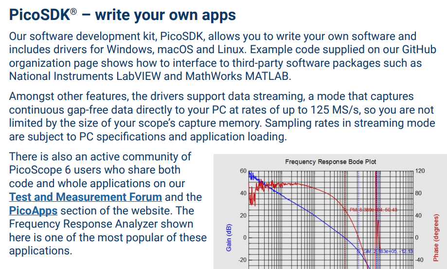

# experiment-scope-multiplex

Multiplexer for sensing experiments

## Proposal

Create a modular analogue signal multiplexing board with three channels at 4:1, two incoming, one outgoing, that can connect to BNC connectors on the pico scope, and using a smaller/cheaper/durable/signal-quality-maintaing connector+cable system on the device-under test side.

## Background

we've purchased 50-off PICO 2204A 2-Channel scopes. They do NOT come with probes.

There are two input channels, and one output channel (AWG).

There is an SDK so we expect to be able to create our own web-based interface, as we did for the [pocket-VNA](https://github.com/timdrysdale/go-pocketvna).

## Details

### Possible experiments

We would like to create some remote laboratory experiments that measure the signals coming from some sensors, and/or process some signals through some simple circuit elements like filters.

### Need for multiplexers

It would greatly enhance the utility of the experiments if we could multiplex more measurements into the system, e.g. using an analogue switch MAX4524 4:1 analogue switch:

We would require three per picoscope, one for each channel of input (to select amongst possible signals to sense), and one for the Arbitrary Waveform Generator (to select which part of the circuit to apply the input to).

### Connection to picoscope

We don't have space to put a long cable, and a small BNC cable is probably going to need custom fabrication. Can we avoid that by directly connecting using [Male PCB mounts](https://www.dosinconn.com/portfolio-item/bnc-male-pcb-mount-right-angled-rf-coax-connector/)? These do not seem widely available.

### Connection from the multiplexor board to our test circuits

It would simplify our planning if the board was modular. Therefore, what is the best connector set to provide on the board? We would need twelve connectors. SMA seem like a good quality option, and save on space, as well as being able to be replugged more often than a press-fit, compact coax used in consumer products. Coax is probably essential to avoid EMC affecting our measurements. So ribbon cables might be "out?"

## Purchasing 

We have already ordered Nano IOT33 for each of the 48 Pico scopes.

We could purchase up front 
- the maxim chips 
- the BNC plugs
- the plugs for the DUT-side of the multiplexer board
- the plugs for the DUT boards (which we have not yet designed, and may be a single board or a series of smaller boards for increased modularity)

We have budget of £480, assuming we fund the PCBs themselves later.

Maxim pricing is approx £3.08 ex-VAT for 50+

A set of 24 multiplexers would therefore require approx parts costs of

Maxim £3.08 x 3 x 24 = £221.76
BNC £2.41 x 3 x 24 = £172.52

Molex 50Ω Right Angle PCB Mount, BNC Connector Bulkhead Fitting, jack (RS 759-5271) £2.41 > 50

The circuit board we can design and fund separately (hopefully)

The connectors are expensive - do we use scope probes to connect to test points instead? 

Or use a non-coax connection directly into the boards (keep wires short?) 

https://cpc.farnell.com/multicomp-pro/mp770799/bnc-male-plug-to-flying-leads/dp/IN09246?
